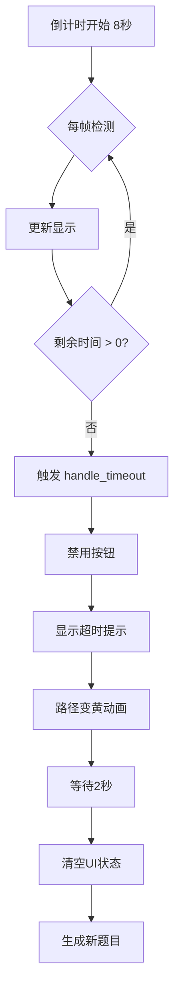

# MazeScene 倒计时系统实现说明

## ⏰ 功能概述

MazeScene 现已完整集成倒计时系统，每道题目有 **8秒** 答题时间。

## ✅ 已实现功能

### 1. 倒计时控制
- **每题8秒**：`QUESTION_TIME = 8.0`
- **自动倒计时**：通过 `_process()` 函数每帧更新
- **超时判定**：时间到自动判定为错误答案

### 2. 视觉反馈

#### ProgressBar (TimerBar) 显示
```gdscript
# 实时更新进度条
timer_bar.value = countdown_timer

# 颜色变化
> 5秒：绿色 Color(0.5, 1.0, 0.5)
3-5秒：黄色 Color(1.0, 1.0, 0.5)
< 3秒：红色 Color(1.0, 0.3, 0.3)
```

#### 时间标签显示
```gdscript
# 显示剩余秒数
timer_label.text = str(time_left)

# 警告效果
> 5秒：白色，正常大小
3-5秒：黄色，正常大小
< 3秒：红色，闪烁放大
```

### 3. 倒计时管理函数

#### `reset_timer()`
重置倒计时到8秒，用于：
- 生成新题目时
- 答错后重试时

#### `stop_timer()`
停止倒计时，用于：
- 玩家选择答案时
- 游戏结束时

#### `clear_ui_state()`
清空所有UI状态，用于：
- 超时后生成新题
- 准备下一题前

### 4. 超时处理流程



## 📊 代码实现细节

### 1. 初始化设置
```gdscript
func setup_ui():
    # 初始化倒计时条（8秒）
    if timer_bar:
        timer_bar.max_value = QUESTION_TIME
        timer_bar.value = QUESTION_TIME
        timer_bar.show_percentage = false
```

### 2. 每帧更新
```gdscript
func _process(delta):
    if is_waiting_answer and countdown_timer > 0:
        countdown_timer -= delta
        update_timer_display()
        
        if countdown_timer <= 0:
            countdown_timer = 0
            handle_timeout()
```

### 3. 超时处理
```gdscript
func handle_timeout():
    # 重置连击
    streak_count = 0
    
    # 禁用按钮
    for btn in answer_buttons:
        btn.disabled = true
    
    # 显示反馈
    show_feedback("⏰ 时间到！\n正确答案是 X", Color.ORANGE)
    
    # 路径动画
    animate_paths_timeout()
    
    # 2秒后生成新题
    await get_tree().create_timer(2.0).timeout
    clear_ui_state()
    generate_new_question()
```

## 🎮 游戏流程

### 正常答题流程
1. 题目生成 → `reset_timer()` → 8秒倒计时开始
2. 玩家点击答案 → `stop_timer()` → 判断对错
3. 显示反馈 → 生成下一题

### 超时流程
1. 倒计时归零 → `handle_timeout()`
2. 显示超时提示 → 路径变黄
3. 清空UI → 生成新题目

### 答错重试流程
1. 答错 → 显示提示
2. `reset_timer()` → 重新8秒倒计时
3. 重新启用按钮 → 等待玩家答题

## 🎨 动画效果

### 倒计时条颜色
- **0-5秒**：绿色（安全）
- **5-3秒**：黄色（警告）
- **3-0秒**：红色（危险）

### 时间标签效果
- **最后3秒**：红色 + 闪烁缩放
- **最后5秒**：黄色
- **正常时间**：白色

### 路径动画
- **超时**：黄色圆圈 🟡
- **正确**：绿色圆圈 🟢
- **错误**：红色圆圈 🔴

## 🐛 测试要点

### 1. 倒计时精度
- 确认8秒准确倒计时
- 检查 `delta` 累加是否准确

### 2. 视觉同步
- ProgressBar 与实际时间同步
- Label 显示与实际秒数一致

### 3. 状态切换
- 答题后倒计时停止
- 超时后UI正确重置
- 新题目倒计时正常开始

### 4. 边界情况
- 在最后0.1秒答题
- 快速连续生成题目
- 倒计时期间切换场景

## 📝 控制台输出示例

```
===== 生成第 1 题 =====
倒计时已重置：8秒

[5秒后未答题]
⏰ 答题超时！
倒计时已停止
UI状态已清空

===== 生成第 2 题 =====
倒计时已重置：8秒
```

## 🔧 配置调整

如需调整倒计时时长，修改常量：
```gdscript
const QUESTION_TIME = 8.0  # 改为你需要的秒数
```

## 🎯 优化建议

1. **音效增强**
   - 最后3秒滴答声
   - 超时警报声

2. **视觉增强**
   - 倒计时圆形进度条
   - 数字滚动动画

3. **难度调节**
   - 根据题目难度调整时间
   - 连续答对减少时间（增加挑战）

4. **暂停功能**
   - 添加暂停/继续按钮
   - 暂停时冻结倒计时