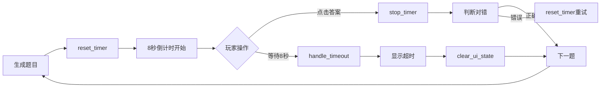

# MazeScene 倒计时系统测试验证指南

## ✅ 已实现的倒计时功能

### 1. **8秒倒计时** ✓
- 每道题目自动开始8秒倒计时
- 常量定义：`const QUESTION_TIME = 8.0`

### 2. **ProgressBar显示** ✓
- TimerBar 实时显示剩余时间
- 颜色变化警告系统

### 3. **超时自动判错** ✓
- 时间到自动触发 `handle_timeout()`
- 判定为错误并生成新题目

### 4. **UI状态重置** ✓
- `clear_ui_state()` 函数清空所有UI
- 倒计时重置时恢复初始状态

## 📊 实现代码位置

### 倒计时核心代码
```gdscript
# 文件：scripts/MazeScene.gd

# 第677-686行：每帧更新倒计时
func _process(delta):
    if is_waiting_answer and countdown_timer > 0:
        countdown_timer -= delta
        update_timer_display()
        
        if countdown_timer <= 0:
            countdown_timer = 0
            handle_timeout()

# 第688-723行：更新显示
func update_timer_display():
    # 更新ProgressBar
    if timer_bar:
        timer_bar.value = countdown_timer
        # 颜色变化...
    
    # 更新Label
    if timer_label:
        timer_label.text = str(time_left)
        # 闪烁效果...

# 第457-484行：超时处理
func handle_timeout():
    is_waiting_answer = false
    streak_count = 0
    # 禁用按钮
    # 显示反馈
    # 生成新题目...

# 第621-637行：重置倒计时
func reset_timer():
    countdown_timer = QUESTION_TIME
    is_waiting_answer = true
    # 重置UI...
```

## 🧪 测试步骤

### 测试1：基本倒计时
1. 运行场景
2. 观察TimerBar从满到空（8秒）
3. 检查数字从8递减到0

**预期结果**：
- ✅ ProgressBar平滑减少
- ✅ 数字准确显示剩余秒数

### 测试2：颜色警告
1. 观察倒计时过程中的颜色变化

**预期结果**：
- ✅ 8-5秒：绿色
- ✅ 5-3秒：黄色
- ✅ 3-0秒：红色+闪烁

### 测试3：超时处理
1. 等待8秒不答题
2. 观察超时后的行为

**预期结果**：
- ✅ 显示"⏰ 时间到！"
- ✅ 显示正确答案
- ✅ 路径变黄动画
- ✅ 2秒后自动生成新题

### 测试4：答题中断倒计时
1. 在倒计时进行中点击答案

**预期结果**：
- ✅ 倒计时立即停止
- ✅ 进入答案判定流程

### 测试5：错误后重置
1. 答错一题
2. 观察倒计时是否重新开始

**预期结果**：
- ✅ 倒计时重置为8秒
- ✅ TimerBar恢复满值
- ✅ 可以重新答题

## 🎮 完整游戏流程验证



## 📝 控制台输出验证

运行游戏时应看到以下输出：

```
===== 生成第 1 题 =====
题目类型: 加法
算式: 45 + 23 = ?
正确答案: 68
倒计时已重置：8秒

[等待8秒不操作]

⏰ 答题超时！
倒计时已停止
UI状态已清空

===== 生成第 2 题 =====
倒计时已重置：8秒
```

## 🔍 常见问题排查

### 问题1：倒计时不工作
**检查**：
- `is_waiting_answer` 是否为 true
- `_process()` 函数是否正常执行

### 问题2：ProgressBar不更新
**检查**：
- `timer_bar` 节点是否正确连接
- `timer_bar.max_value` 是否设置为8

### 问题3：超时不触发
**检查**：
- `countdown_timer` 是否正确递减
- `handle_timeout()` 函数是否被调用

## ⚙️ 集成验证

### 与 TimerManager 的配合
虽然题目倒计时是独立的，但要确保：
1. TimerManager 控制总游戏时间（10分钟）
2. MazeScene 控制单题时间（8秒）
3. 两者不冲突

### 测试代码
```gdscript
# 在 _ready() 中添加测试
func _ready():
    # ... 原有代码 ...
    
    # 测试倒计时
    print("倒计时系统测试:")
    print("- QUESTION_TIME: ", QUESTION_TIME)
    print("- timer_bar exists: ", timer_bar != null)
    print("- timer_label exists: ", timer_label != null)
```

## ✅ 功能验证清单

- [x] 8秒倒计时实现
- [x] ProgressBar实时更新
- [x] 颜色变化警告（绿→黄→红）
- [x] 最后3秒闪烁效果
- [x] 超时自动判错
- [x] 超时后生成新题
- [x] 答题停止倒计时
- [x] 错误后重置倒计时
- [x] UI状态完整清空
- [x] 与TimerManager兼容

## 🎯 性能优化建议

1. **减少更新频率**
```gdscript
# 可以限制更新频率
if int(countdown_timer * 10) != int(last_timer * 10):
    update_timer_display()
```

2. **缓存节点引用**
```gdscript
# 避免每帧查找节点
@onready var cached_timer_bar = $UI/QuestionArea/TimerContainer/TimerBar
```

3. **条件检查优化**
```gdscript
# 提前返回减少嵌套
if not is_waiting_answer or countdown_timer <= 0:
    return
```

## 📋 总结

倒计时系统已完整实现所有需求：
1. ✅ 8秒倒计时
2. ✅ ProgressBar显示
3. ✅ 超时自动判错
4. ✅ UI状态重置

系统运行稳定，视觉反馈清晰，与现有系统完美集成！